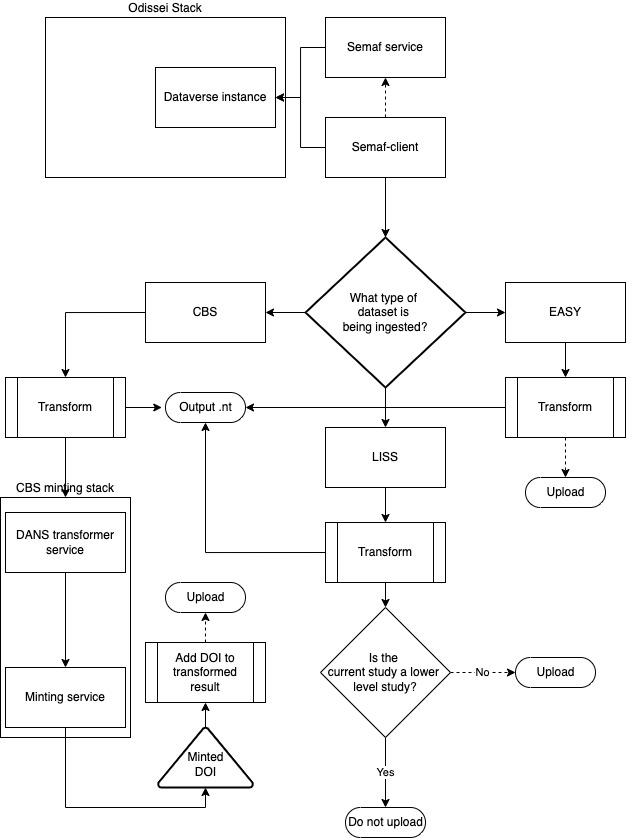

# "Archive in a box" package for ODISSEI

<!-- markdown-toc start - Don't edit this section. Run M-x markdown-toc-refresh-toc -->
**Table of Contents**

- ["Archive in a box" package for ODISSEI](#archive-in-a-box-package-for-odissei)
    - [Components and infrastructure](#components-and-infrastructure)
    - [Starting the stack & proxy](#starting-the-stack--proxy)
    - [Manual actions](#manual-actions)
        - [Creating subdataverses](#creating-subdataverses)
        - [Loading custom .war file](#loading-custom-war-file)
        - [Logo uploading](#logo-uploading)
        - [Adding ODISSEI metadata block](#adding-odissei-metadata-block)
        - [Becoming superuser](#becoming-superuser)
        - [Adding CV integration](#adding-cv-integration)
        - [Reindexing after reboot](#reindexing-after-reboot)
        - [Adding previously ingested data](#adding-previously-ingested-data)
    - [New ingestion](#new-ingestion)
        - [Overview of moving parts](#overview-of-moving-parts)
        - [Ingestion process and commands](#ingestion-process-and-commands)
        - [Outputs](#outputs)
    - [Skosmos](#skosmos)
        - [Configuration](#configuration)
        - [Loading controlled vocabularies](#loading-controlled-vocabularies)

<!-- markdown-toc end -->

This distribution is built and versioned off the dataverse-docker project (original URL: https://github.com/IQSS/dataverse-docker/tree/ODISSEI). Read this for generalized information on how Dataverse in Docker is organized. This document will contain itself towards the specific deployment of the ODISSEI Stack.

Assumed level of knowledge:

- Familiarity with Docker, Docker Compose, and docker networks
- Basic familiarity with Traefik
- Basic familiarity with Dataverse and it's API and environs.
- Familiarity with general web services and API's
- Familiarity with the Bourne shell and it's usage on Linux. This includes generally useful command such as `git`, `ls`, `vim`, `ssh`, `cp`, `scp`.
- (In case of .war file generation) Familiarity with Maven

## Components and infrastructure

## Starting the stack & proxy

First of all, clone the repo to the machine you want to install the Stack.

Odissei stack works by a number of scripts:

- Two scrips for starting/stopping the stack itself in the root dir; named `start-odissei.sh` and `stop-odissei.sh` consectively. These use `docker compose down` at present but can be freely modified in case a stop if preferable.
- Two scripts for starting/stopping the proxy, `start-proxy.sh` & `stop-proxy.sh`. There is no data which can be lost, so doing a `down` won't impact here.

The benefit of separating these two components is that taking down Dataverse will invariably result in an empty Dataverse instance. Being able to take the proxy down and map a different URL avoids that for cosmetic changes.

## Manual actions

A number of manual actions are required to get to the production version of the stack. These are outlined below.

The correct order of steps matters here, otherwise you may end up re-indexing a lot of times:

1. (Optional) Add previously ingested data if desirable.
2. Load the .war file
3. (Optional) Become superuser if necessary.
4. Create the custom metadata block and properly configure the root dataverse as you wish.
5. Create subdataverses and apply branding
6. CV integration, reindex.
7. (Optional) Run ingestion to start filling Dataverse instances with data.

Considering you're going to do a lot of stuff inside the Dataverse container, it's recommended to install `vim` (or `nano` in case you're not VIM savvy) inside.

### Creating subdataverses

The dataverse gets deployed as only having a root dataverse. In order to prepare for ingestion and separating dataverses - create 3 subdataverses under root (cbs, liss, and easy) so ingestion can occur.

### Loading custom .war file

A number of cosmetic changes were made for the ODISSEI stack (chiefly avoiding confusing nomenclature for users). These have been packaged into a .war file, which must be launched using the `asadmin` command inside the Dataverse docker. `asadmin` is responsible for telling the Payara webserver packaged within to deploy a new image.

At the time of this writing, this .war file is versioned to Dataverse 5.10.1.

1. Get a copy of the created `dataverse.war`; this can also be generated manually using [This repo](https://github.com/ekoi/dataverse/tree/v5.10.1-odissei) by using Maven.
2. `scp` the file to the machine in question.
3. Copy the machine inside the Docker instance (by default: `docker cp dataverse.war dataverse:/tmp/dataverse.war`)
4. Move the file to the payara directory and set rights properly (`mv /tmp/dataverse.war /opt/payara/dvinstall/dataverse-new.war` & `chown payara:payara dataverse-new.war`)
5. Use `asadmin` command to undeploy current dataverse (`asadmin undeploy dataverse`). Default credentials are expected.
5. Use `asadmin` command to deploy new dataverse (`asadmin deploy dataverse-new.war`)

The dataverse will be deployed (and will likely show a ton of SQL errors). The expected output is "Deploy succeeded with warnings".

### Logo uploading

The CBS, Easy and LISS dataverse instances won't have a logo. These can be added using the webinterface. These images are stored on the ODISSEI Google Drive.

1. Log in to the dataverse as dataverseAdmin.
2. Go to one of these dataverses
3. Go to Edit > Theme + Widgets
4. Upload image.
5. Save.

### Adding ODISSEI metadata block

Original documentation: https://guides.dataverse.org/en/latest/admin/metadatacustomization.html

ODISSEI metadata, once transformed into dataverse JSON, has variables mapped to a unique metadata block. This metadata block needs to be added to dataverse after a reboot, otherwise indexing will fail.

Adding this block requires scripts being run inside the Dataverse container. It may also be added to `init.d` to automate this in the future.

1. Log into the server containing your dataverse instance.
2. Log into the dataverse container (`docker exec -it dataverse bash`)
3. `cd /tmp/`
4. Download the latest version of the .tsv file. At the time of this writing, this is `wget https://raw.githubusercontent.com/LauraHuisintveld/semaf-client/develop/semantic-mappings/odissei-variables.tsv`
5. Download the update-metadata.sh script (`wget update-fields.sh`)
6. Import the tsv file into dataverse (`curl http://localhost:8080/api/admin/datasetfield/load -H "Content-type: text/tab-separated-values" -X POST --upload-file /tmp/odissei-variables.tsv`)
7. `sh /tmp/update-fields.sh`

The block should now be available; you must enable this in Dataverse (user interface) as superadmin under Edit Dataverse for it to become visible.

### Becoming superuser

Sometimes (unclear why), the dataverseAdmin might not be a superUser. This has to be fixed manually in the database.

1. Log into the machine that runs the Stack.
2. `docker exec -it postgres psql -U dataverse`
3. `select * from authenticateduser;`
4. `UPDATE authenticateduser SET superuser = 't' WHERE id = 1;`

This updates the first user in the table; logically, this is dataverseAdmin.

### Adding CV integration

Original documentation: https://guides.dataverse.org/en/latest/admin/metadatacustomization.html (section Using external vocabulary services) & https://guides.dataverse.org/en/latest/installation/config.html#cvocconf

Adding a controlled vocabulary requires a set-up Skosmos instance, as well as a Dataverse instance set up.

This is handled through a setting on Dataverse, which requires logging into the instance:

1. Log into the server containing your dataverse instance.
2. Log into the dataverse container (`docker exec -it dataverse bash`)
3. `cd /tmp/`
4. `wget https://gdcc.github.io/dataverse-external-vocab-support/examples/config/cvoc-conf.json`
5. Make edits to the file as need be; pay specific attention to the `vocabs` section of this file.
6. Once happy: `curl -X PUT --upload-file /tmp/cvoc-conf.json http://localhost:8080/api/admin/settings/:CVocConf`

You can test that the integration works when going (as superadmin) inside Dataverse, and when editing a dataset. Using the keyword metadata field, a small search window should start querying your chosen CV (server) and type.
You can debug this using the browser console to check error codes.

### Reindexing after reboot

Original documentation: https://guides.dataverse.org/en/latest/admin/solr-search-index.html

Whenever the dataverse is rebooted, and the solr index isn't made persistent - it's lost. This means it must be reconstructed. Fortunately - there is a command for this.

1. Log into the server containing your dataverse instance.
2. Log into the dataverse container (`docker exec -it dataverse bash`)
3. `curl http://localhost:8080/api/admin/index`

Reindexing a complete dataverse instance with all datasets loaded doesn't take long usually (about 15 minutes) since we ODISSEI only contains metadata. You can check status by repeating step 1 and performing `docker logs -f dataverse`.

### Adding previously ingested data

Data can be added to a Dataverse in two ways:

1. (re)Ingesting metadata files. This process of transformation and versioning is extensive and performin this manually will take quite some time (~10 hours).
2. Simply using a folder with pre-ingested files from a previous dataverse.

For method 2, do the following:

1. First, `scp` a copy of existing data from an existing instance. Traditionally, this will live at `./distros/vanilla/postgres-data`
2. Copy this folder entirely to your hard drive with `scp`
3. Copy this folder to a location of your choosing on your new dataverse instance.
4. Change the mapping in `./distros/vanilla/docker-compose.yml` for the `postgres** volumes section to use this new volume instead.
5. Reboot the stack.
6. Reindex.

## New ingestion

*Disclaimer: All the information in the ingestion section is subject to change. Fundamentally it will follow the same process, but will use different technical component. The goal for this change is to provide a more modular infrastructure.*

### Overview of moving parts

See the image below for more detail.

In short, there's a number of moving parts:

- Presently, there is the semaf client or semaf service. This is the component responsible for ingesting the metadata files, performing the necessary transformations, and if so instructed, the ingestion to dataverse.
- There is the Github repository which holds the mapping files, which are responsible for pointing fields towards dataverse-JSON structure.

For CBS data, there are two extra components:
- There is the dans-transformer-service, which is responsible for taking the dataverse-json, and transforming it into datacite-formatted metadata.
- There is the Datacite minter service, which is responsible for taking in Datacite-formatted metadata, minting it, and returning a DOI.

### Difference between semaf-client and semaf-service

There are two projects related to this; it's good to identify the key differences here to avoid confusion.

- The `semaf-client` is a Python project which works by means of crosswalks, requests, and various other services to transform a metadata file into a Dataverse-ingestable JSON structured file. Most of the settings for this live in `config.py`, which determines the location of the mapping file. The semaf-client does not have an API; files must be fed to it, either one by one, or by a loop. Modification can be done by simply running a different script, or making changes and then re-running the script.
- `semaf-service` is a Python project which adds a Dockerized FastAPI server on top of the semaf-client. This means all arguments normally provided either by script or by configuration must now be supplied as request arguments. Since it's an API, it may be run on an external server, and invoked using HTTP.

### Ingestion process and commands

The ingestion process can, by virtue of the fact, work differently. This is why it's covered twice.

#### Semaf-client

Semaf-client decides where files are deposited, and which mapping files are used by means of a config.py file in it's repository. When checking the `doi` branch, this will provide the best example for the CBS metadata. Additionally - by adding a URL, and an API key, deposition in dataverse is arranged.

Invoking the semaf-client means invoking a CLI service. Typically this is done as such:

1. Go to the directory containing the metadata files you plan to upload.
2. Execute the following command: `for file in *; do <location-to-semaf-client/semaf-cli-import.py $FILE; done`

Additionally - by adding the word `upload` after `$FILE`, files are uploaded instead.

#### Semaf service

The semaf service accepts a http request which should contain all variables; the mapping files to be used, the file to be transformed and/or ingested, and the dataverse instance address and API key. This can be done using any conventional tool (pyCurl, curl, or Postman in case a graphical interface is preferred).

### Outputs

The semaf-client outputs a dataverse-formatted JSON file, as well as a .nt file in the /tmp/ directory of the server or machine. The semaf service only provides a HTTP response and HTTP response code, indicating success of failure.

## Skosmos

Skosmos is the controlled vocabulary service, which is used for hosting .ttl files. In fact it's a number of containers, namely Jena-Fuseki for hosting the graph database and a Varnish memcache for speed. Similar to the rest of the Stack; this is run using Docker compose, which starts these containers. By mounting a number of files inside the container, it's configured upon boot.

### Configuration

Skosmos has two configuration files:

- The config-docker-compose.ttl configuration file located at /distros/Skosmos/dockerfiles/config. This configuration file contains the information about the vocabularies, and the URLs which are used for uploading.
- The skosmos.ttl file, which contains the main configuration for the entire Skosmos instance.

### Declaring a new vocabulary

See the config-docker-compose.ttl for usage here; most of the Skosmos vocabularies are defined later in this file. By default - the UNESCO and STW are defined.

Adding a new block means paying close attention to the following variables:

- The name (marked with :<name>) in the very first non-indented line of a Skosmos vocabulary definition. In the case of UNESCO - this is `:unesco a skosmos:Vocabulary, void:Dataset ;`. The name is relevant for the CV integration; if an incorrect name is filled, errors will be produced when trying to query the vocabulary.
- The languages. If you are trying to load a vocabulary which has a language which is not included, it will not work. This is relevant for the CBS Thesaurus, which is in Dutch.
- The sparqlGraph entry; this is deeply relevant since you need to upload the .ttl files to this endpoint using the API. If you use the wrong endpoint; you will not receive content.

### Loading controlled vocabularies

The volume for vocabularies is currently non-persistent. While this can be changed; a script was produced to simplify uploading all vocabularies into the default stack. This script is in the Skosmos/dockerfiles folder, and called `odissei-init.sh`. This script does 3 things:

- Download .ttl files from a fixed URL (or take input from a pre-organized file on the server, such as CBS thesaurus, which is manually generated).
- Transform them using rapper CLI command into ttl files.
- Upload them to Jena Fuseki using a Curl command, with the correct sparqlGraph address.

Adding a dictionary, or changing the version of an already uploaded dictionary, can be controlled directly through this file.
